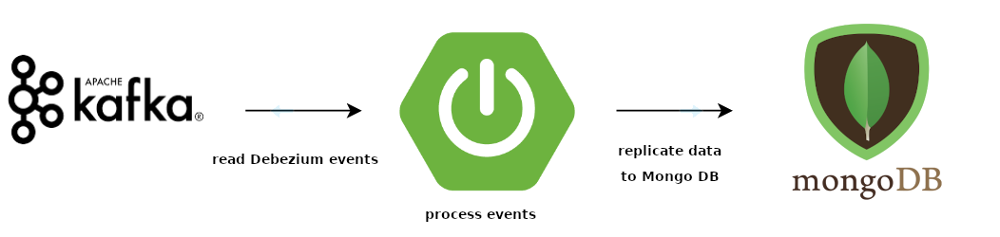

The following project reads the MySQL Debezium events from Apache Kafka and processes it to replicate data to MongoDB.

---
### App architecture


---
### App code architecture

- **kafka consumer**: Component that consumes and verifies Kafka events.
- **integration service**: Responsible service that defines the entity affected by the event.
- **management service**: Responsible service that defines the operation to do in the entity.
- **product service**: Service that define the operations to perform in the database.

---
### Build local environment

1. Create a docker image of the replicator app [Dockerfile](Dockerfile)
```
  docker build -t es.paradigma.cdc/replicator-mongodb:0.0.1-SNAPSHOT <Dockerfile-path>
```

2. Build environment (MySQL + Apache Zookeeper + Apache Kafka + Apache Kafka Connect + MongoDB and Debezium MySQL connector) [Script](environment/init_environment.sh)
```
  sh init_environment.sh
```

> **NOTE:** To stop environment [Script](environment/stop_environment.sh)
>
> ```
>    sh stop_environment.sh
> ```

---
### Reference Documentation
For further reference, please consider the following sections:

* [Spring for Apache Kafka](https://spring.io/projects/spring-kafka)
* [Debezium](https://debezium.io/documentation/reference/index.html)